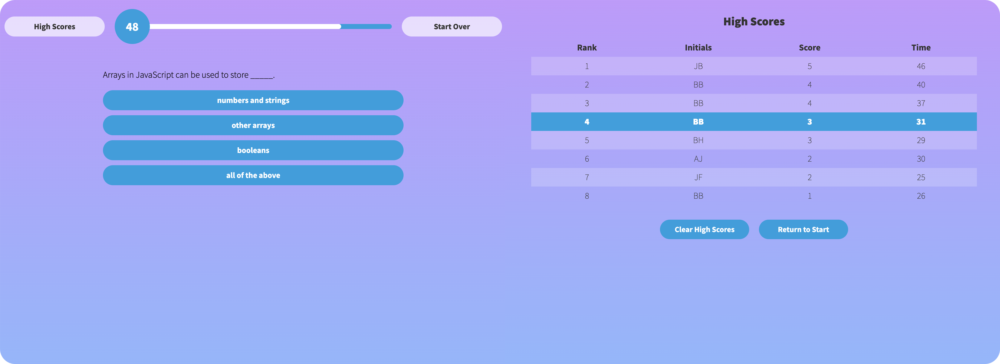

# Code Quiz

## Description

A mobile-friendly website presenting a short quiz on basic JavaScript syntax and concept definitions. The quiz incorporates the following features required by the coding challenge:
- Use of **vanilla JS DOM manipulation** to dynamically present multiple screens of content to the user without reloading the page.
- Use of `setInterval` and associated functions to implement a quiz timer.
- Use of **event listeners** to enable user navigation and to handle form submissions.
- Use of `localStorage` to save user scores across browser sessions.
- Use of **JSON** functions to handle the storage/retrieval of user score data.
- Layout that mimics the mockup provided with the challenge.

Extra features included for completeness and UX considerations include:
- Responsive layout for desktop, tablet, and mobile devices, enabled by the use of `@media` queries.
- Incorporation of audio elements.
   
   
   

   

## Usage

The website provides an interactive quiz that can be attempted multiple times, and a high score table where users can submit their scores to a persistent record (kept in `localStorage`). The page can be viewed [here](https://binderb.github.io/code-quiz/) on GitHub Pages.

## Credits

Design mockup provided by the UofM Coding Bootcamp (Trilogy Education Services); all code was written by the developer.

## License

Please refer to the LICENSE in the repo.

